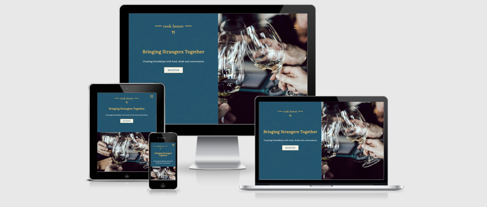
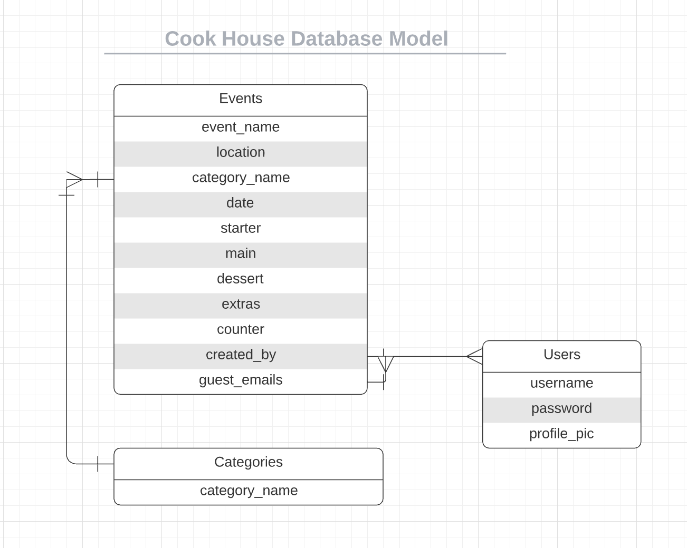
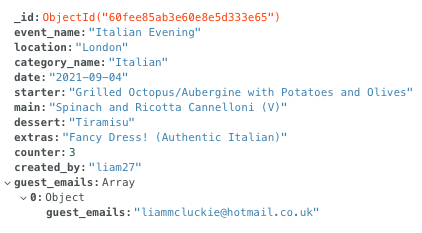

# Cook House

[View Live Project Here](https://cook-house-project.herokuapp.com/)

## Overview 

Cook House is a website that focuses on bringing strangers and friends together through the simple art of food, drink and conversation. The purpose of this website is for like minded users that either want to attend or host private supper clubs in their own homes to be able to do so through this platform. Users will be able to create an event in order to host their own evening which will be open invitation (with limited numbers) for any other members of the website. The author of the event will be able to choose the cuisine, dress code and other optional extras. Users will also be able to leave reviews on hosts profile as well as ask further questions on the event post. This project will have a strong focus on database creation and usage. 

## Table of Contents

### 1. [UX](#ux) 
    
#### 1a. [User Stories](#user-stories)

#### 1b. [User Centered Design](#user-centered-design)
- Strategy 
- Scope 
- Structure 
- Wireframes

### 2. [Design](#design)
- Colour Scheme
- Typography
- Imagery

### 3. [Database Model](#database-model)

### 4. [Features](#features)

### 5. [Technologies Used](#technologies-used)
- Syntax
- Frameworks, Libraries & Programs

### 6. [Testing](#testing)
- [Testing Document](TESTING.md)

### 7. [Deployment](#deployment)

#### 7a. GitHub Pages
- Forking the Repository 
- Cloning the Repository

#### 7b. Heroku

### 8. [Credits](#credits)
- Resources
- Code 
- Content
- Media
- Acknowledgements

## UX

### User Stories

- **User Goals**

    a. As a user, I want to be able to access the site from any device.

    b. As a user, I want to know that my personal information is safe and stored securely on a database.

    c. As a user, I want to enjoy using the website through great aesthetics and a strong UX/UI.

    d. As a user, I want to be able to find using the websites functionality simple with clear instructions.

    e. As a user, I want to have full control of my account following computer programming CRUD (create, read, update & delete) operations.

    f. As a user, I want to have full control of my created events following computer programming CRUD (create, read, update & delete) operations.

- **First Time Visitor Goals**

    a. As a first time visitor, I want to immediately and clearly understand the purpose of the website.

    b. As a first time visitor, I want to see a gallery section from other users supper clubs to gain a better understanding of the offering available.

    c. As a first time visitor, I want to find creating an account a quick, simple and secure process.

- **Returning Visitor Goals**

    a. As a returning visitor, I want to be able to search the website to find supper clubs by location and cuisine.

    b. As a returning visitor, I want to be able to register to attend supper clubs and find out further information through asking the host questions.

    c. As a returning visitor, I want to be able to see further examples of what other users have used the platform for to enhance understanding.

    d. As a returning visitor, I want to be able to contact the websites admin if I have any issues or questions.

- **Frequent Visitor Goals** 

    a. As a frequent visitor, I want to be able to leave reviews on hosts past supper clubs that I've attended.

    b. As a frequent visitor, I want to be able to create my own supper club evenings easily whilst adding all the necessary details specific to my event.

    c. As a frequent visitor, I want to be able to manage my own posts either by editing or deleting them.

    d. As a frequent visitor, I want using the website to have a good community feel through active and regular user activity.

---

### User Centered Design

#### Strategy

- The main goal of this website is to convert visitors into registered and active users. Due to the nature of this website there will be a lot of content only available to registered users, such as events and host information. This means that in order to convert a visitor the landing page has to draw them in, which will be done using a bold and fun colour palette as well as aesthetically pleasing imagery and imagery displaying the enjoyment of users from this website.

- Private supper clubs are not always a common and well known activity and historically they have always been shrouded in secrecy. To further increase the chance of converting visitors into users there will need to be a clear and well detailed about section. This should include a brief history explaining what a supper club is and a short introduction of how this website is used for these events. This section needs to be short as to not overwhelm users, and also fit into the rest of the websites aesthetics complimenting the imagery and design of the landing page.

- The main functionality of this website and the ideal steps a new user would take are the following;

    - Explore the websites landing page, taking in the imagery and information.

    - If a new visitor had any questions to send these via a contact form.

    - Create a new account and update profile details.

    - Explore the additional features available to registered users. 
    
    - Look at upcoming supper clubs, and search the websites database to see the types of events that have been done previously.

    - Express interest and attend a supper club.

    - Post their own supper club evening event.

    - Remain a regular and active user, attending and hosting supper clubs as well as leaving reviews.

    This will all be achieved through creating a clear and strong UI focusing on well structured content hierarchy. By doing this the website without necessarily giving the user physical instructions will lead the user to all the above steps.

--- 

#### Scope | Trade Off

- **The main features and content in the initial design plan that are of highest priority are;**

    - Fully responsive website regardless of viewing device size.

    - Fixed navigation bar.

    - About section included on the landing page.

    - Gallery section included on the landing page using images from previous events.

    - Validated and functioning contact form using [Emailjs.](https://www.emailjs.com/)

    - Allow users to create and manage their own account.

    - Allow users to create event posts with full CRUD functionality.

    - The ability for logged in users to search the websites database for events by location, name and cuisine.

    - The website will include a home page, register & sign in page, contact page, supper club page, and create event page.
        - The supper club and create event page will be hidden to any visitors not signed into an account.

    - A form for users to fill out in order to create a supper club event which will then be listed on the websites supper club page.

    - For users to be able to leave reviews/comments on supper club events.

- **The features and content in the initial design plan that are of a lower priority and may not be including in this build are;**

    - A feature that allows users to click attend/register interest for a specific supper club event.

    - Testimonial section to possibly further enhance the chance of converting a visitor to a user.

    - Integrating [Google Maps API](https://developers.google.com/maps) to display the location of supper club events to users.

    - The ability for users to customise and add further information to their profile page such as preferences, images, bio descriptions etc.

    - A featured users section that includes top rated/most active and past events they have hosted.

---

#### Structure

- The basic structure of the website is;

- Header/Navigation - *Top Level*

    - The navigation menu will be a hamburger/bars menu icon regardless of screen size, this will also be fixed in the top right corner allowing the user to navigate regardless of their position on the page. 

    - The clicked navigation menu will open a full screen overlay that includes the navigation items on the right and the websites logo on the left. On small devices only the navigation links will be visible.

    - The header will also include a hero section split into two full height columns. One column which includes a hero image/slideshow and the other column will contain the logo, call to action text and a sign up button.

- Body - *Main Page Elements*

    - Firstly a combination of text content and images will be used to convey the about section.

    - Then the gallery will be a simple layout of two rows and three columns wide, on large screens, with a hover effect that displays information regarding the image using a coloured overlay.

    - The first element of the supper club page will be a search bar to allow users to find specific events.

    - Where the supper club events are listed the layout will be cards with interactive elements such as buttons, and input comment areas.

    - The pages specific to using forms will have minimal to none additional content in order for the forms to be the main focus point.

- Footer - *Bottom Level*

    - This will also contain navigation links to reduce user clicks when at the bottom of a page.

    - Social media links placed here to ensure the user does not navigate away from the page to soon.

    - Copyright and legal information placed here.
    
    - The websites logo to reinforce the users awareness of the company.

---

#### Wireframes

- [Desktop website view](wireframes/desktop.pdf)

- [Tablet website view](wireframes/tablet.pdf)

- [Mobile website view](wireframes/mobile.pdf)

## Design

### Colour Scheme

- The colour scheme for this website contains three colours a main, secondary and accent colour. The primary and secondary colours are being used as they feature in the logo, and the accent colour which fits into the colour palette will be used as a contrast colour. These colours have been chosen as they create an effect of calming, fun/happy but will still look sleek, stylish and professional.

- Blue Sapphire (#075570) - Primary Colour - This very dark blue shade is the background colour of the websites logo and will be used throughout for certain background colours such as the navigation menu, and button colours. Blue which naturally has a calming effect, however, using this much darker tone creates a stylish, modern and luxurious effect.

- Blue Sapphire Dark (#06445a) - Primary Colour Dark - A slightly darkened version of the primary colour used throughout the site to help with accessability and readablity where needed.

- Golden Tainoi (#ffc145) - Secondary Colour - This colour is used for the outline of the logo and is a striking contrast the the Blue Sapphire primary colour, that pops out and is extremely aesthetically pleasing. Described as a light orange colour with yellow tones, this colour creates an emotion of happiness and joy something that goes hand in hand with the main purpose of supper clubs which is to bring people together.

- Golden Tainoi Dark (#cc9a37) - Secondary Colour Dark - A slightly darkened version of the secondary colour used throughout the site to help with accessability and readablity where needed.

- Sugar Cane (#f1f1e6) - Accent Colour - This colour will feature throughout the project as a neutral contrast colour to break up the bold colours of the primary and secondary. It will also be used as a background colour when the Blue Sapphire colour really needs to stand out to the user. Described as a light greyish yellow this colour fits in with the palette perfectly, it will never draw attention away from main colours and does exactly what an accent colour needs to.

- Soft Red (#f25c66) - Cancel/Delete Colour - Used as a warning indicator for the user whenever they are making ireversible changes such as deleting their account/events, or to display cancelling an action such as editing their profile/event.

### Typography

- There will be two fonts used throughout the website. The titles and main elements font will be Lora, and the accompanying body font will be Open Sans. Both fonts come from the Serif family, however Lora is a Serif specific so that will be used for the fall back font, whereas Open Sans will have the fallback of Sans-Serif.

- **Lora** - A calligraphy focused serif font which compliments the luxurious colours used as it's a elegant and stylish that stands out well when used with titles and main elements.

- **Open Sans** - A simple, easy to read font that compliments the bold strokes of Lora and works well as a body font. This font is described as friendly and neutral.

---

### Logo

- The logo for this project was generated through [Hatchful](https://hatchful.shopify.com/) for the initial design, I then customised the font and colours. As mentioned above I chose two striking and stand out colours for the logo. The font used is a Serif style font to match the Lora font that will be used for titles and main elements throughout the website. For the graphics in the design I decided that in order to immediately portray the focus of this website using something related was needed, this led to the decision to use a simple illustration of a knife and fork underneath the text. The design around the text is purely for aesthetic reasons however it does draw the users eye to the main focus point by acting as leading lines.

### Imagery

- Imagery for this website will mainly feature on the landing page in order to not only show visitors what this website's focus is and what other users use the platform for, but also to convey information about the concept. The images used will be of high, professional quality and will mainly be food focused photos but also with some candid imagery of people enjoying eating, drinking and conversing together in private spaces. These images especially will enhance the chance of converting visitors into users.

- Featuring minimally throughout the website will also be the use of icons. These will mainly be used in form sections to convey what a certain element is asking the user to input. For example when a user is creating an event in the section where they are asked for their menu the cutlery icon will be used here. This not only looks aesthetically pleasing but it will compliment the overall fun, enjoyable feeling conveyed from the website.

## Database Model

- This project uses [MongoDB](https://www.mongodb.com/) for all database aspects. MongoDB is a cross platform document-orientated database program. Classified as a NoSQL database program it uses JSON-like documents with optional schemas. 

- The main schema used in this project is ObjectId.
    - The objectId schema type provides 12-bit MongoDB-specific unique values that can be used as identifiers for objects.
    - This assigned to any document added to a collection in the database in order to manipulate it at a later date by searching the database by using the ObjectId.

- Below is the database diagram plan used for structuring the database in this project. 

As outlined above the three collections in this database are;

- Events - This is the most important as the entire platfrom is based around this functionality. 
    
    - Users create an event which is added into the database which stores the author in the event which is then related to the 'Users' collection.

    - When a user signs up for an event their email address is then added to this document in the form of an array (see screenshot below).

    

- Categories - Here all the categories available for the user are stored, these are displayed on the front end when creating/editing an event. Most importantly though this collection is used for searching through created events for specific categories.

- Users - All successful user registrations are stored here with passwords being securly stored by using Pythons Werkzeug Wecurity password hash. This generates a random character string that disguises the users password in the database, without affecting the password that they registered with.

## Features 

### Existing Features

- Responsive on all screen sizes and devices.

- The appearance on all buttons and links alters when the user clicks or hovers.

- Success or error messages that will display depending on if the user correctly or incorrectly uses the forms on the website.

- Custom error pages that cover all main errors

- Animated navigation menu button and screen.

- Copyright date in all footers that autmoatically updates each year.

---

#### Specific Landing Page Features

- Display specific navigation links to the user depending on whether they have signed in or not. This is done by using logic to check if they are signed in and which links are displayed to them.

---

#### Specific Register Page Features

- Specific error messages are displayed if the user does not fill out the input fields as expected/requested. All of these fields must be correct for the user to successfully register.

- This is achieved using HTML `REGEX pattern` attribute with `min` and `max` attributes.

---

#### Specific Profile Page Features

- All of the users profile information is displayed including their name and profile picture in an aesthetically pleasing way.

- The user can follow all CRUD operations on this page including editing all aspects of their profile and created events as well as deleting both of these.

- For deleting either there profile or events a confirm modal will pop up once the delete button has been selected asking the user to confirm this. 
    - If the user has created an event that guests have already joined they will not be able to delete this event and will have to contact the websites administrators by following the contact link.

- A message is displayed to the user depending on if they have created any events yet or not. If they have not a message will prompt them to create their first, else it will ask them if they would like to create more. This increases the likelihood of the websites overall purpose which is for users to create Supper Club events.

---

#### Specific Supper Club Page Features

- All created events are displayed here in ascending order of when the event is due to take place, therefore showing the user the events that will be taking place closest to the current date.

- The user has the option whether or not they would like the menu for a specific event to display by clicking the 'See menu' button. This has been done in order to not overwhelm the user with information.

- Any event that's date has expired, meaning the event has taken place, will automatically be deleted from the website's front-end and database through the `delete_expired_events()` function.

- This is where users can register for specific events. Each event will have a number field that starts at 0 and displays how many guests are currently attending each event, the maximum amount of guests for any event is 20 persons. 
    - If a user wishes to join an event they add the number of guests they would like to attend to the already displayed total, if this is not done correctly they will not be allowed to proceed and an error message will be displayed.

    - Once this has been done a 'Join' button will display, this then prompts the user for their email address, they can also choose to cancel at this point, once inputted and confirmed a success message will be displayed and the guests total will be updated. 

    - The users email address will then be added to this event in the database to then be passed onto the author of the event.
    
- A search bar allows the user to search for events based on the event name, cuisine and location. Once they have searched the user can select 'Clear' which takes them back to the default Supper Club page displaying all events. This further increases the overall UX of the website increasing user retention.

---

#### Specific Contact Page Features

- Animated icon to increase the overall UI and desired look of the website.

- Specific error messages displayed for each field if the user does not fill out the fields correctly/at all.

- Success message displayed if all fields are correctly filled out and the form is submitted successfully.

- This page uses [Emailjs](https://www.emailjs.com/) to send the users message to the websites admin through a template using Javascript. Once this has been submitted an automatic response is then sent to the user to confirm that the administrators will be in touch soon.

---

### Future Features

- Include a form of map api in order to display a visual location of each event to the user.

- Review section that allows users to upload reviews of Hosts to their profile along with images of the event happening. These images would then be displayed on a gallery section on the landing page.
    - The initial project plan included this feature however it fell outside of the scope for the current build.

- Add pagination to the supper club and profile page so that if the events exceeded a certain total the events would be displayed on a new page and pagination would be displayed.

- Further features added to the search feature to further refine the specifics of the users search.

- The abilty to upload images through a direct file instead or a URL using [Cloudinary](https://cloudinary.com/) to host the images.

- Add a blog page that includes a newsletter sign up, this would feature specific events that had taken place.

## Technologies Used

### Syntax

- [HTML5](https://en.wikipedia.org/wiki/HTML5)
    - HTML5 is a markup language used for structuring and presenting content on the internet.

- [CSS](https://en.wikipedia.org/wiki/CSS)
    - Cascading Style Sheets (CSS) is a style sheet language used for describing the presentation of a document written in a markup language such as HTML.

- [Javascript](https://en.wikipedia.org/wiki/JavaScript)
    - Javascript is a lightweight, interpreted, object-oriented language with first-class functions, and is best known as the scripting language for Web pages, but it's used in many
    non-browser environments as well.

- [JQuery](https://jquery.com/)
    - jQuery is a JavaScript library that allows web developers to add extra functionality to their websites. It is open source and provided for free under the MIT license.

- [Python](https://www.python.org/)
    - Python is an interpreted high-level general-purpose programming language. Python's design philosophy emphasizes code readability with its notable use of significant indentation.

---

### Frameworks, Libraries & Programs

- [Balsamiq](https://balsamiq.com/)
    - The Balsamiq application was used to create wireframes for each website page on various device screen sizes.

- [Font Awesome](https://fontawesome.com/)
    - Used to display icons as well as the social media icons in the footer.

- [Bootstrap](https://getbootstrap.com/)
    - Bootstrap was used throughout the site for responsiveness using the grid system, all forms and all modals.

- [Google Fonts](https://fonts.google.com/)
    - Used to import the two fonts used throughout the site 'Lora' and 'Open Sans'.

- [GitHub](https://github.com/)
    - Used to host the entire repository for the project.

- [GitPod](https://gitpod.io/workspaces/)
    - The code editor used to build the entire project.

- [TinyPNG](https://tinypng.com/)
    -  Used this to compress all the images used on the website to decrease the file size and increase website load speed.

- [Favicon](https://favicon.io/)
    - Used to generate the websites favicon logo of various sizes for different devices.

- [Am I Responsive](http://ami.responsivedesign.is/)
    - A tool to check how the website appears and the functionality on various devices. The image at the top of this document was generated from this website.

- [Responsinator](http://www.responsinator.com/)
    - Similar to [Am I responsive](http://ami.responsivedesign.is/) this is a web based application that allows a website to be checked an a large amount of devices in portrait and 
    landscape view.

- [Hero Patterns](http://www.heropatterns.com/)
    - A collection of repeatable SVG background patterns for you to use on your web projects.
    - Used for the background pattern featured throughout this project.

- [W3C Validator HTML](https://validator.w3.org/) & [W3C Validator CSS](https://jigsaw.w3.org/css-validator/)
    - Both of these were used to test all the code for the project whilst working and for the finished website to check for valid HTML and CSS.

- [JSHint](https://jshint.com/)
    - This is a tool used to detect errors or potential problems within Javascript code, it was used to test and validate all Javascript written for this project.

- [CSS Autoprefixer](https://autoprefixer.github.io/)
    - This was used to add vendor prefixes to the CSS used in the project to increase cross browser compatibility.

- [Pylint](https://www.pylint.org/)
    - Pylint is a source-code, bug and quality checker for the Python programming language.

- [Jinja](https://jinja.palletsprojects.com/en/3.0.x/)
    - Jinja is a web template engine for the Python programming language. It allows writing code similar to Python syntax. Then the template is passed data to render the final document.
    - Jinja templating is built into the [Flask](https://flask.palletsprojects.com/en/2.0.x/) library.

- [PyMongo](https://pymongo.readthedocs.io/en/stable/)
    - PyMongo is a Python distribution containing tools for working with [MongoDB](https://www.mongodb.com/)

- [Flask](https://flask.palletsprojects.com/en/2.0.x/)
    - Flask is a micro web framework written in Python. It is classified as a microframework because it does not require particular tools or libraries.
    - Flask also requires the [Jinja](https://jinja.palletsprojects.com/en/3.0.x/) template to work

- [Flask PyMongo](https://flask-pymongo.readthedocs.io/en/latest/)
    - Allows the bridge between Flask and PyMongo whilst connecting to the required MongoDB database.

## Testing

Find all information on the testing that has been carried out for this project [here.](TESTING.md)

## Deployment