[Return to ReadMe file](README.md)

## Testing Table of Contents

### 1. [Code Validation](#code-validation)

### 2. [User Story Testing](#user-story-testing)

- [First Time Visitor Goals Testing](#first-time-visitor-goals-testing)
    
- [Returning Visitor Goals Testing](#returning-visitor-goals-testing)

- [Frequent Visitor Goals Testing](#frequent-visitor-goals-testing)

### 3. [Browser Compatibility and Device Responsiveness Testing](#browser-compatibility-and-device-responsiveness-testing)

### 4. [Google Lighthouse Testing](#google-lighthouse-testing)

### 5. [Bugs](#bugs)

## Code Validation

Throughout this project all code has been regularly ran through HTML, CSS and Javascript validators to ensure there are no errors within the code. See below screenshots of all validated and passed code. Due to the nature of this project and the use of Jinja templating code the HTML was passed into the validator from viewing page source in the browser.

Outlined for each page is the decision why the warnings present have not been corrected.

### [CSS Validation](testing/css-valid.png)

- The majority of warnings present relate to unknown prefix vendors that have been added by [Autoprefixer](https://autoprefixer.github.io/) to increase cross browser compatibility. These warnings have not been corrected due to this being a necessary practice.

---

### [HTML Validation](testing/html-valid.png)

- Due to the nature of this project and some content being dynamically added using Jinja templating loops this caused errors within HTML files due to required unique attributes repeating names. 
    - Since these were all event elements the fix was adding `{{ event._id }}` to these duplicated attributes in order to make them unique again.

- There are no errors present for any html pages within this project, however, there is a warning caused by a section having no `<h></h>` tag.
    - This warning is present due to the section including Flash messages that if not displayed mean the section does not include the desired `<h></h>` tag. I felt that this warning did not need to be corrected in this circumstance.

---

### [Javascript Validation](testing/js-valid.png)

Warnings Present:

- The unused variable name `validateForm` is an event function that gets called withing the HTML file `contact.html`. Due to this this warning can be ignored and no changes were made.

- The two instances of the same undefined variable `emailjs` is caused from the code required to call and run the Emailjs send mail function. Therefore this warning can be ignore and no changes were made.

- The undefined variable `$` is caused from the use of the Javascript library JQuery that JSHint does not recognise. Therefore this warning can be ignored and no changed were made.

## User Story Testing

### User Goals

- *"As a user, I want to be able to find using the websites functionality simple with clear instructions."*

    - All pages include an informative introduction header if needed.

    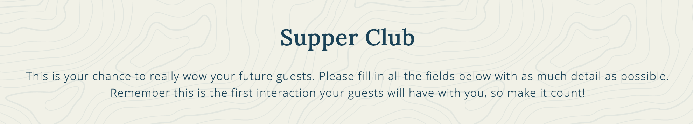

    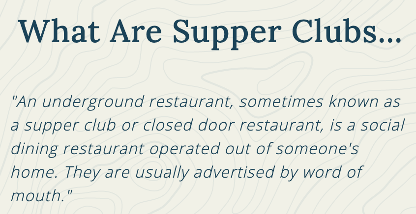

    - User input fields contain clear instructions as to what the user needs to input to successfully proceed or complete the task.

    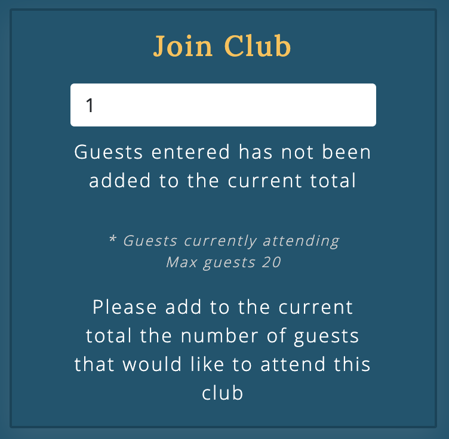

    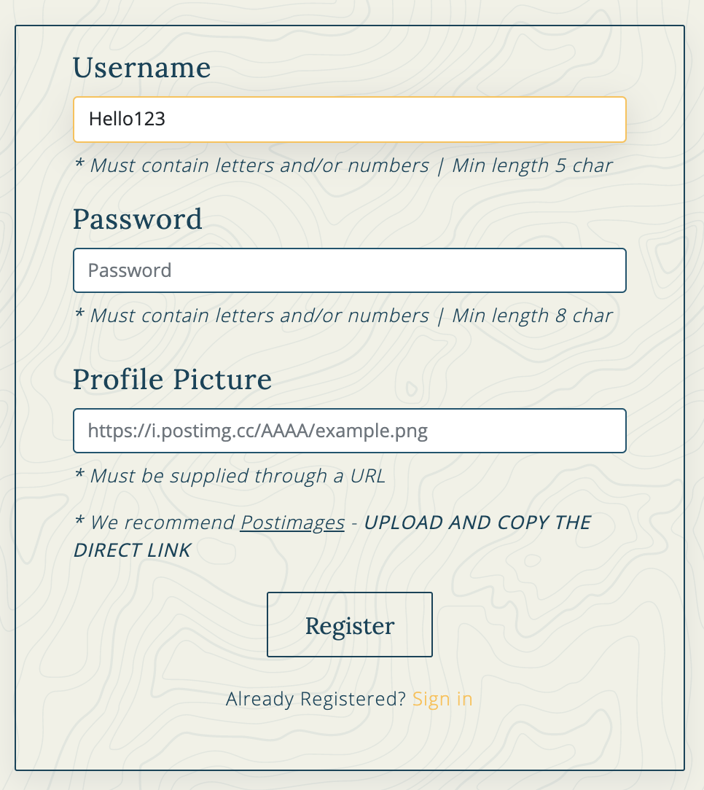

    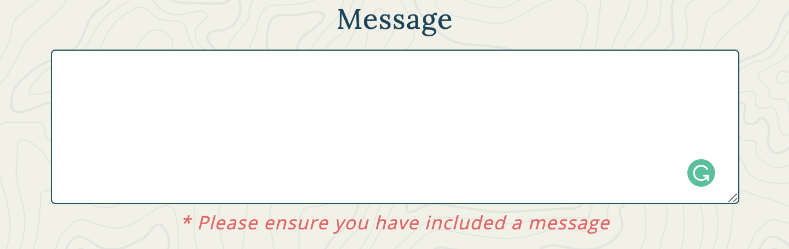

- *"As a user, I want to have full control of my account following computer programming CRUD (create, read, update & delete) operations."*

- *"As a user, I want to have full control of my created events following computer programming CRUD (create, read, update & delete) operations."*

    - This project has implemented computer programming CRUD functionality for any data that a user adds. This includes all aspects of the user created event as well as their profile details.

    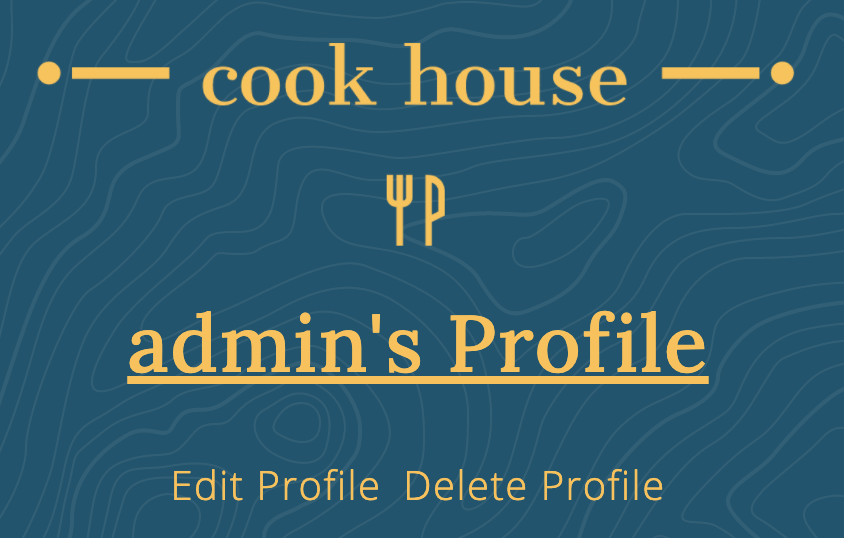

    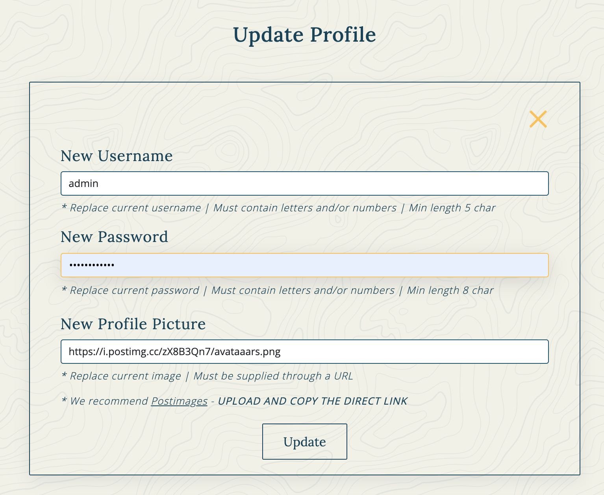

    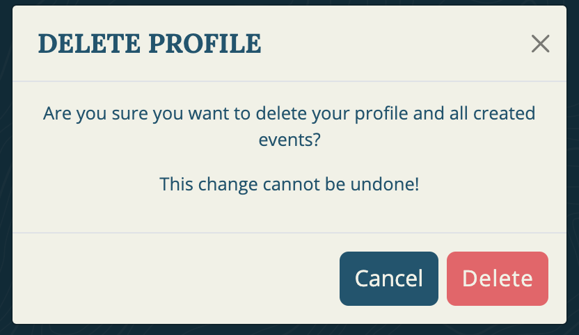

    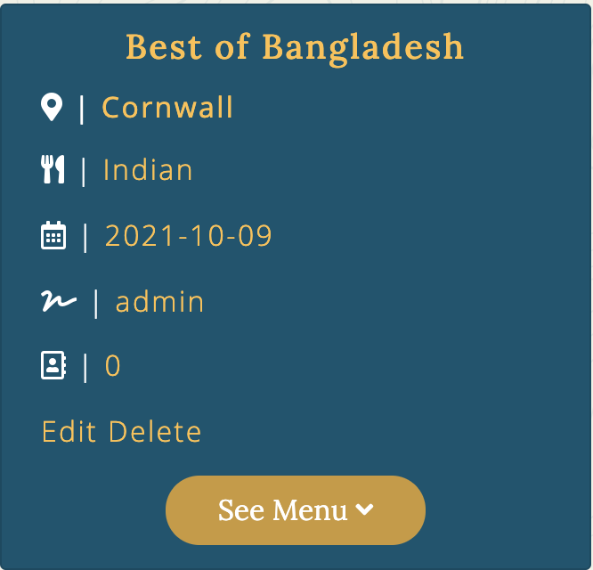

    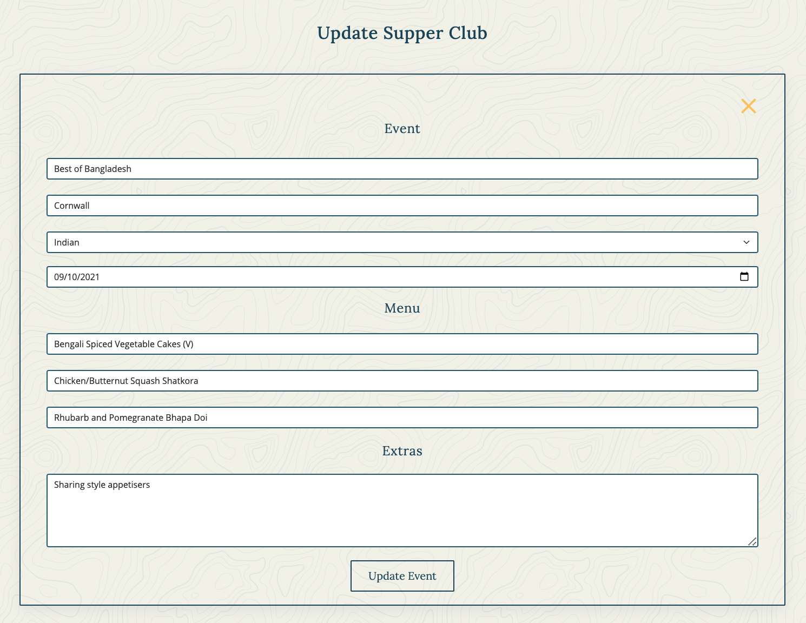

    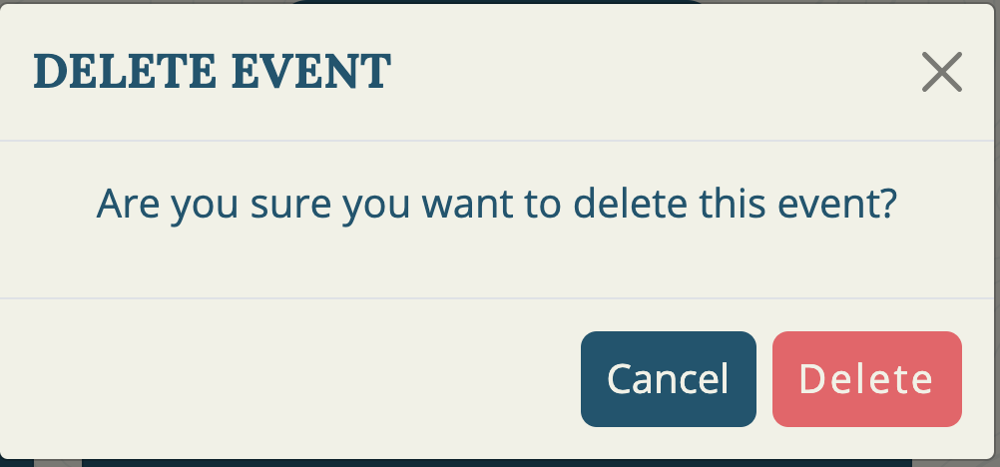

---

### First Time Visitor Goals

- *"As a first time visitor, I want to immediately and clearly understand the purpose of the website."*

    - This is clearly explained in detail on the landing page through related imagery and content. For this project I chose to only include this information on the landing page with no other content as to not overload the user with information.

    - Due to this there is a higher chance of a first time visitor not being distracted by other content, therefore thoroughly understanding the purpose of this website.

    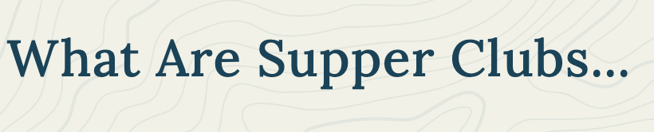

    

    

- *"As a first time visitor, I want to find creating an account a quick, simple and secure process."*

    - All navigation links are displayed as a top level feature as well as in the footer. This increases the UX of the website as including links in the footer as well as a fixed overlay nav menu means the user does not need to scroll in order to navigate away from their current location.

    - Depending on the users session status a CTA button is displayed on the landing page. If the user is not signed in the button will display *"Register"* therefore meaning a first time user can instantly sign up with one click.

    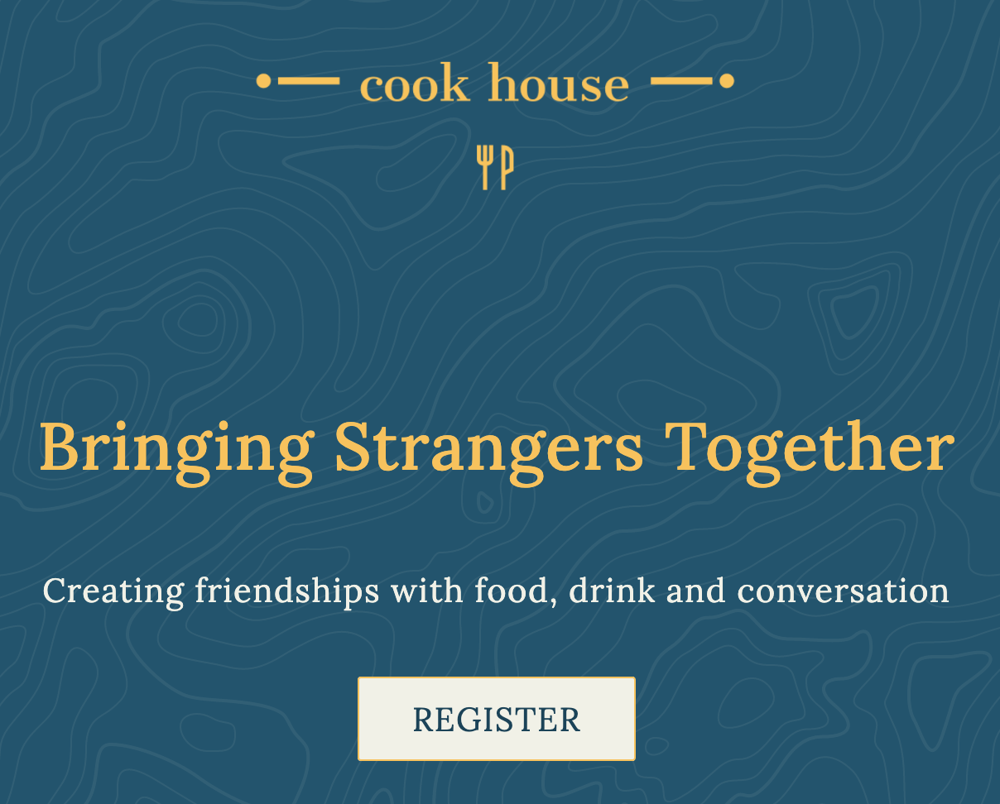

---

### Returning Visitor Goals

- *"As a returning visitor, I want to be able to search the website to find supper clubs by location and cuisine."*

    - Displayed at the top level of the "Supper Club" page is a search icon that when clicked displays a search bar.

    - The placeholder text informs the user of the content they can search by.

    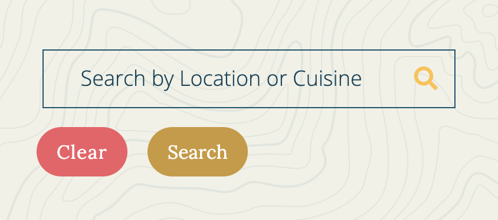

- *"As a returning visitor, I want to be able to register to attend supper clubs."*

    - This functionality is possible through using a counter system. When the user creates an event a counter field with the integer `0` is assigned to the event in the DB. The user/guest can then add the amount of guests they would like to attend a specific event by selecting to join using their email.

    - Their email is then assigned to said event if successful. For future builds I would like to set up a function that sends all guests signed up to an event a follow up email.

    

    

- *"As a returning visitor, I want to be able to contact the websites admin if I have any issues or questions."*

    - This project has a generic contact form for users to use for any type of enquiry. The link for this can be found in the fixed overlay main navigation as well as the footer.

    - There are also two other instances of displaying the contact page link to the user. This happens if the user tries to delete an event that has guests signed up for.

        - The reason for this is so that Admin can contact the guests in question prior to the events being deleted to ensure all users are aware and have an overall excellent experience.

    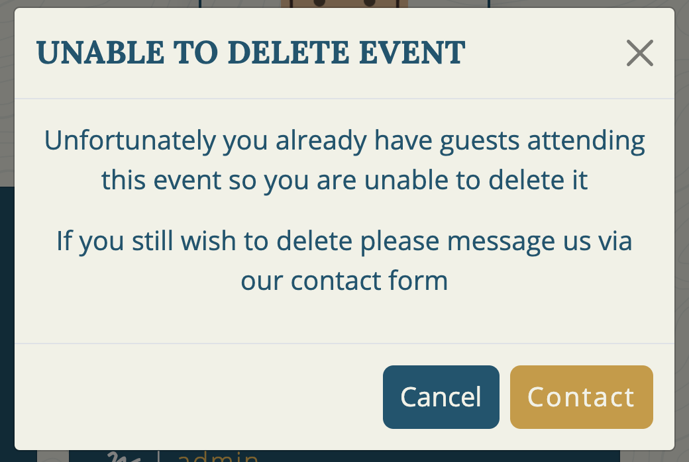

---

### Frequent Visitor Goals

- *"As a frequent visitor, I want to be able to create my own supper club evenings easily whilst adding all the necessary details specific to my event."*

    - A thorough and well planned event form has been created that allows users to add all relevant information for this type of event. It also gives the user an option to add any additional information they would like to through an "Extras" text area.

    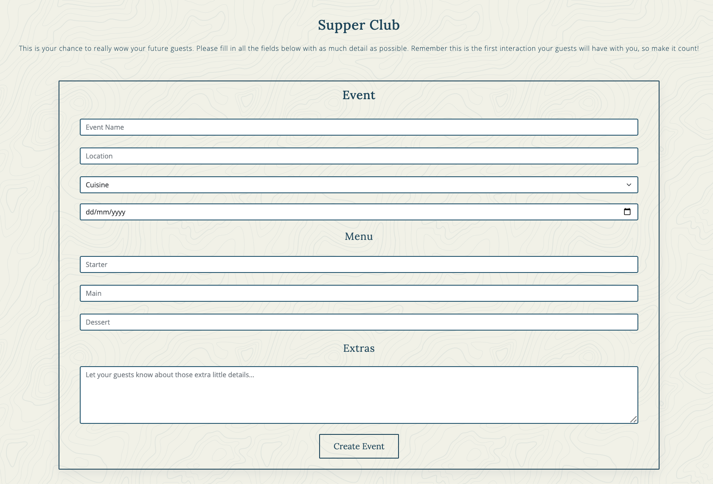

- *"As a frequent visitor, I want to be able to manage my own posts either by editing or deleting them."*

    - This is achieved by including a users "Profile Page" that includes all the expected content such as the users created events. This is the location where all information can be edited/deleted as the user chooses.

- *"As a frequent visitor, I want using the website to have a good community feel through active and regular user activity."*

    - Achieving this initially has been done through creating a good amount of events through certain admin users. To continue this there have been CTA buttons placed throughout the website to prompt users to keep creating events, or if they haven't already to start creating events.

    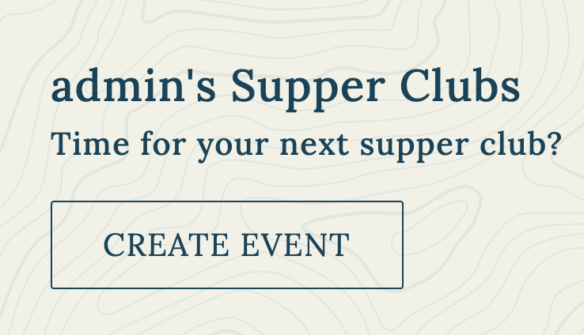

    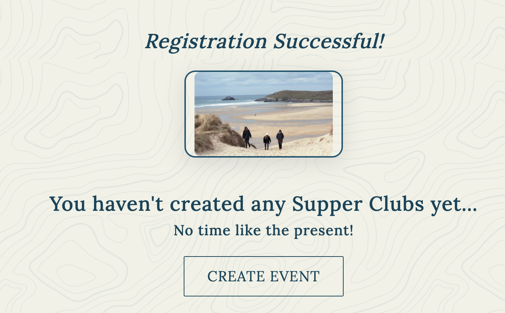

## Browser Compatibility and Device Responsiveness Testing

- This project was tested throughout the build on various device types and sizes using Google Chrome Developer Tools as well as other web based applications mentioned in the ReadMe document such as [Am I Responsive](http://ami.responsivedesign.is/) and [Responsinator](http://www.responsinator.com/) to ensure fluid and error free responsive design, screenshots from this testing can be viewed [here.](testing/responsive-test/device-test.pdf) The deployed website was also continually tested on my own personal device of an iPhone 11 as well as an iPhone 12 mini to ensure the project worked as intended see screenshots below.

    **Iphone 12 Mini**

    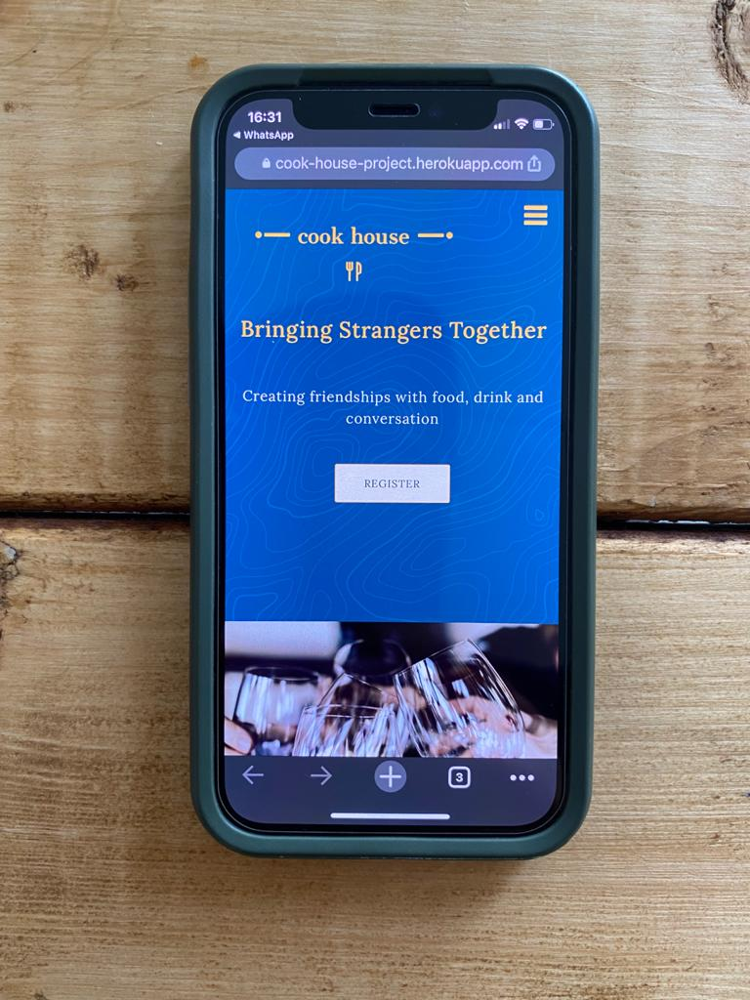

    **Iphone 11**

    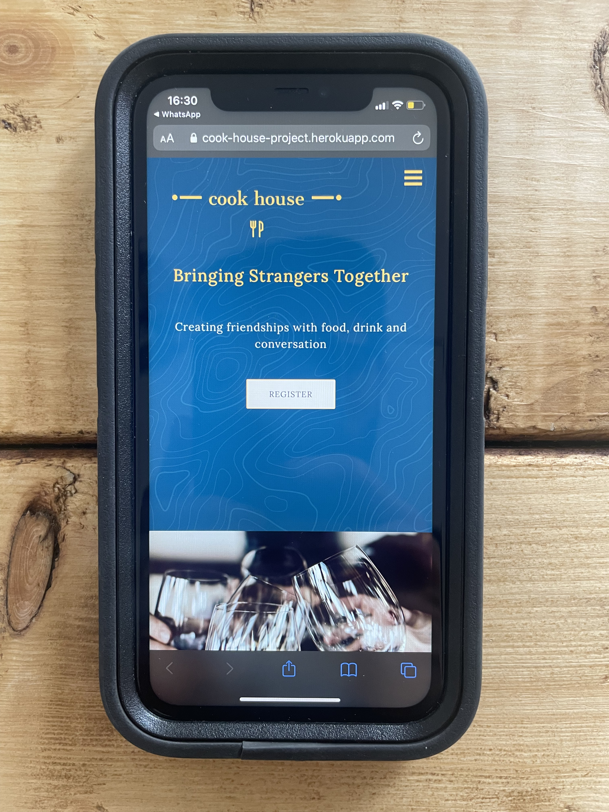


Once the project was completed a cross browser compatibility test on five different browsers was carried out using a web based application [BrowserStack](https://www.browserstack.com/). I also checked this by downloading the browsers that were available to further ensure testing was thorough.

This table in the pdf below shows how all the projects pages responded on different device screen sizes and being used on various browsers, the grading key is as follows;

Good - Appears exactly as intended aesthetically and functionally

OK - Appears as intended functionally but some aesthetics may have slightly altered

Poor - Website still functions correctly but key elements do not appear as intended

[See file here.](testing/cross-browser-test.pdf)

- Referenced in the above document is a compatibility bug found in Safari due to the css property `background-attachment: fixed` not being fully supported. This was being used to create a parallax effect when scrolling, it has now been removed but below shows how this originally worked.

[Video of original desired parallax effect viewing in Google Chromw](https://www.youtube.com/watch?v=Xhi7vaV7i70&ab_channel=LiamMcLuckie)

## Google Lighthouse Testing

Once the main build of this project was completed a test for mobile and web was carried out for all pages using Google Developer Tools Lighthouse application. Using the report I then went through the project and made as many recommended alterations as possible to improve the website inline with the areas that lighthouse focuses on.

Below are two example screenshots of the profile page report for desktop and mobile. To see reports for all pages in desktop click [here](testing/lighthouse-test/lighthouse-desktop.pdf) and for all page reports on mobile click [here](testing/lighthouse-test/lighthouse-mobile.pdf).

**Profile Page Desktop**

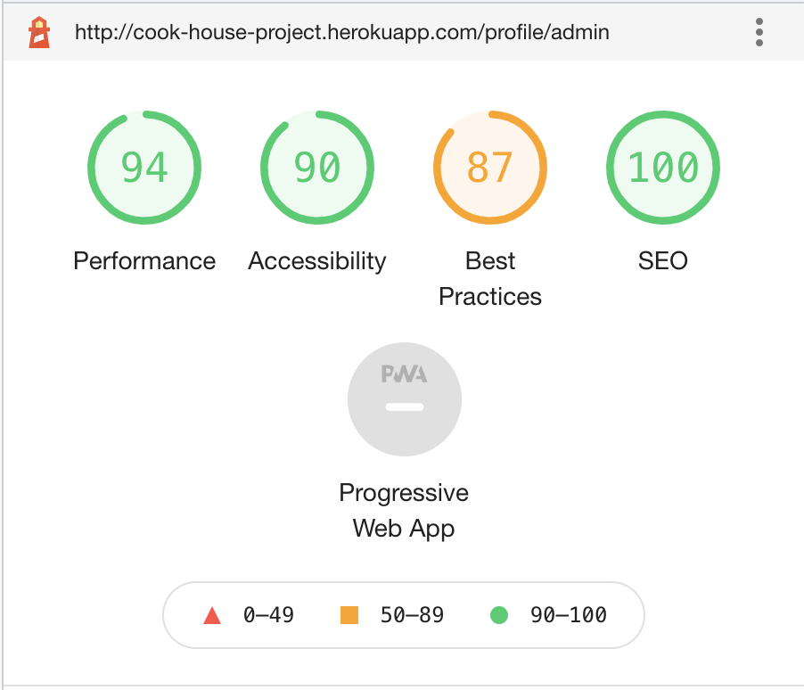

**Profile Page Mobile**

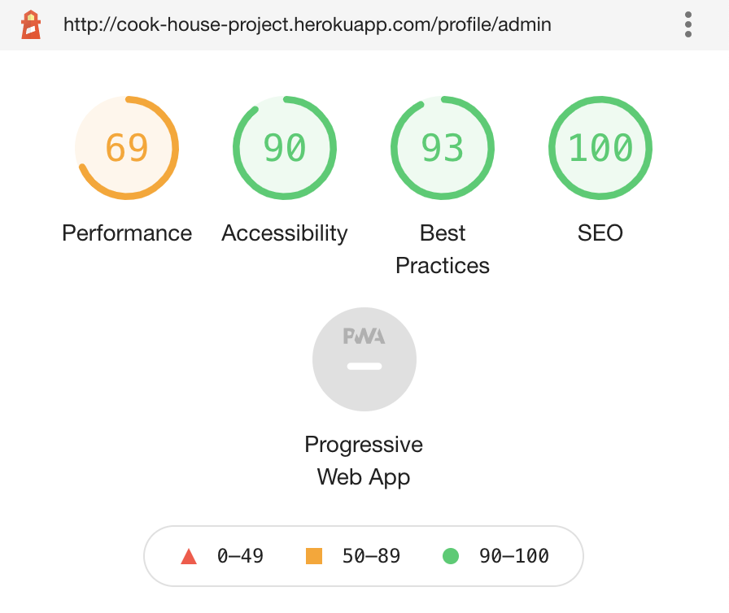

- Overall there were no major changes needed from the outcome of the testing. For mobile testing the performance dropped slightly due to load time however this could only really be dramatically increased through less code which is not possible.

- Best practice dropped scores on form pages but this was due to the HTTPS not being secure which is not an issue for this project.

- There were also some slight improvements to be made for accessibility on various pages, mostly needing to add `aria-labels` to certain elements such as `anchor tags` that do not include text.

## Bugs

Listed below are the major bugs that I encountered whilst building this project and how I resolved them.

1. Adding event listeners to each individual card buttons and on click change the display of the `.card-menu`.

    Initially the issue came from trying to target specific classes etc but since they are dynamically added this wasn’t possible as targeting a specific class wasn’t enough.

	- I then created the `forEach()` loop which is currently there selecting all the buttons and adding an event listener which worked.
	- Initially I tried to call a function when adding my event listener and doing the necessary logic checks within the called function on the .card-menu class. This worked but opened all the card menus regardless of the button clicked.
	- I then started to look at using the ‘this’ keyword however this targeted the button itself.
	- Finally I removed the button container code so the .card-menu was the next element sibling which is how I got to the current solution by performing DOM traversal.

2. When testing the "Supper Club" page on my mobile device I noticed a bug with the `See Menu` button. The bug was that the button needed to be clicked twice in order to display the menu. Once this had been done a single time for each button it would then work as intended with a single click.

    This bug was caused by the function I had written to check and then change the elements styles. The initial line of code causing the bug was written as below;

    `if (item.nextElementSibling.style.display === "none")`

    The reason the double click was needed was because the style being checked for in the CSS wasn't explicitly written, therefore the first click created the above style property meaning the second click successfully displayed the menu as intended. The below code is the fix for the bug which just needed a simple or statement adding.

    `if (item.nextElementSibling.style.display === "" || item.nextElementSibling.style.display === "none")`

3. When adding the functionality for users to join events some logic had to be written to ensure that the user data inputted was correct and matched the format needed e.g the amount of guests needed to be ADDED to the already displayed total amount of guests. 

    The issue I came across with this was adding error messages to the event card in question, which worked correctly. However, each time the user got an error message it would display this as a new message under the current error message. This was due to the loop within my JavaScript function that was needed to access the dynamic content DOM elements.

    This bug was fixed by adding a line of code within a `foreach()` statement that removed an error message if there was already one present.

    `item.parentElement.querySelectorAll('.counter-error').forEach(counterError => counterError.remove());`

4. The search box CSS animation that appears on the "Supper Club" page would not work correctly when testing the website on a real life mobile. The reason for this is still unknown as I could not find anything from de-bugging or research. 

    As I still wanted to keep the animation for desktop I added a media query in that meant the search box was always displayed if the users device was less than a certain width.

    ```
    @media (max-width: 480px) {
    .btn-search ~ .input-search {
        width: 18rem;
        border-radius: 0px;
        background-color: transparent;
        border: 1px solid var(--primary-color);
    }
    ``` 

[Return to ReadMe file](README.md)